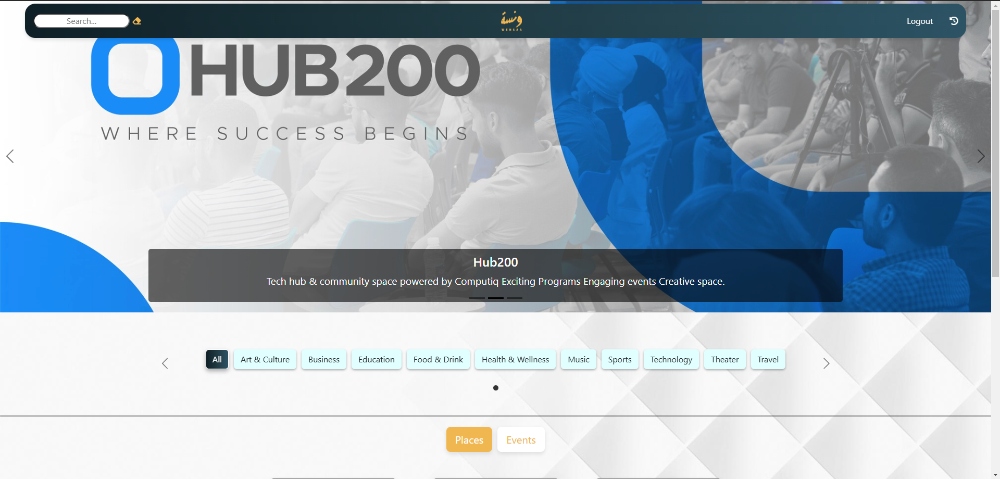
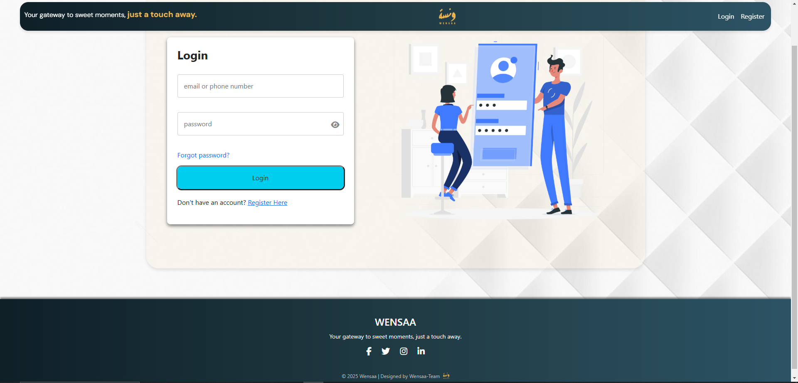
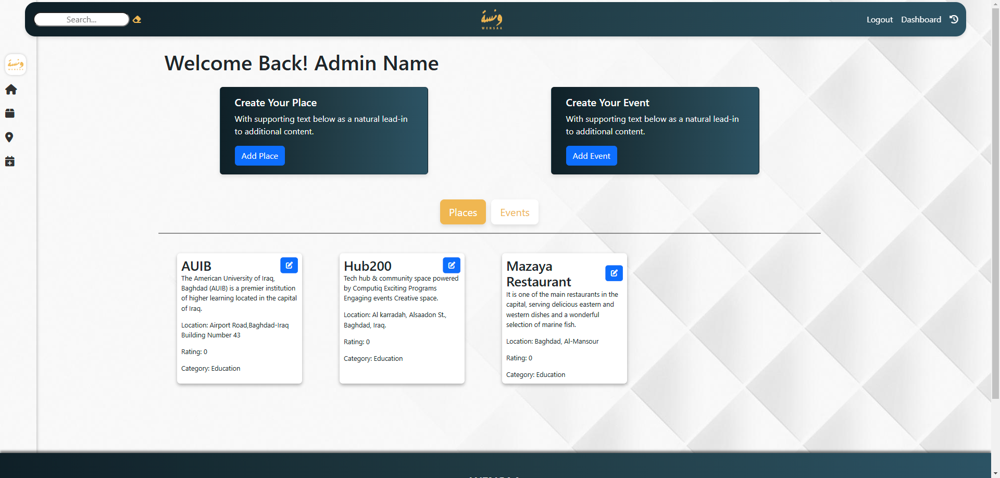
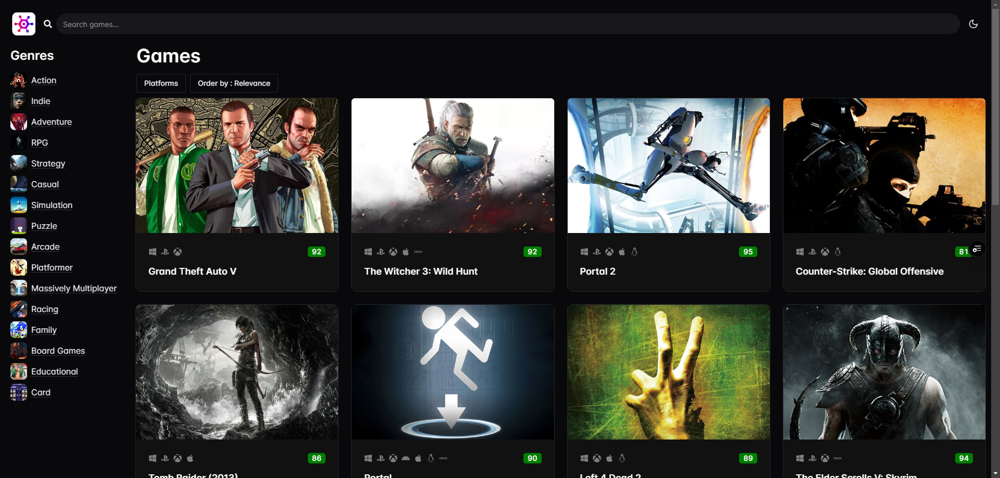
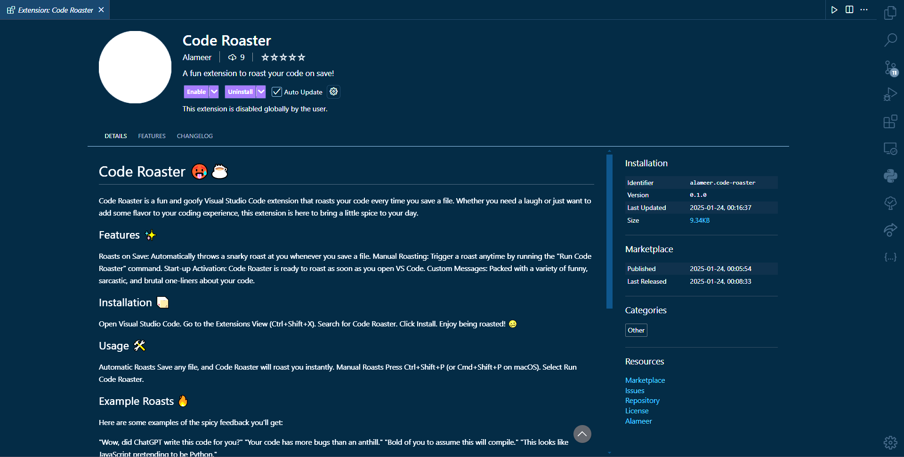
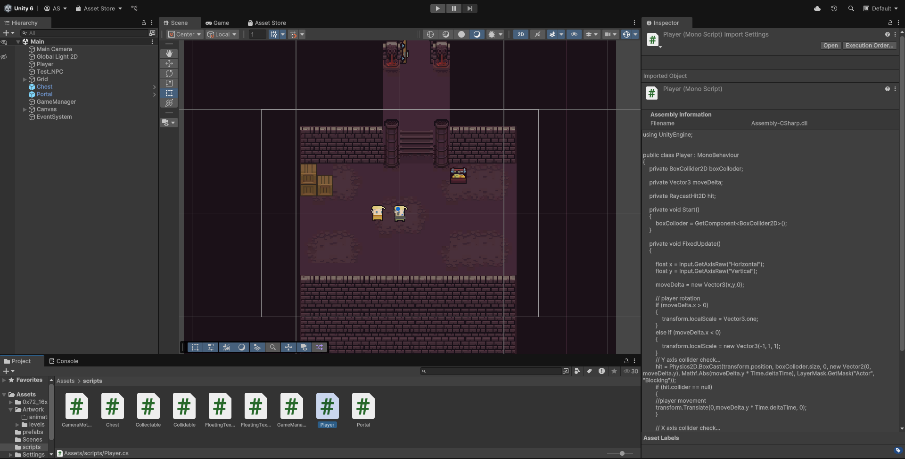
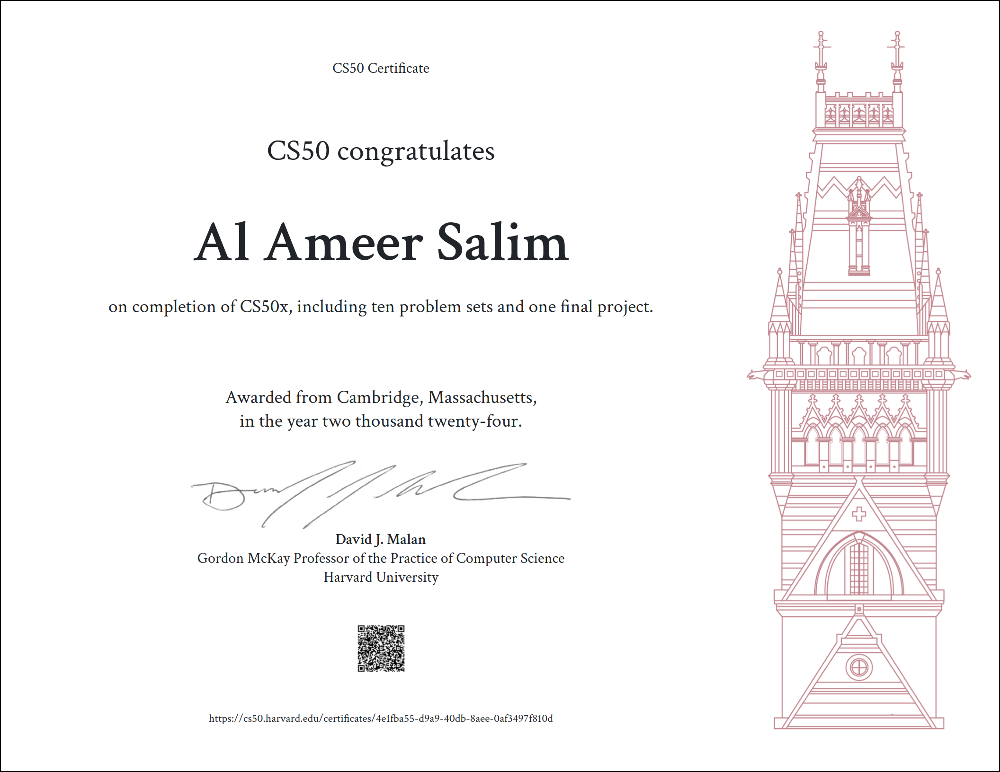

# Hi, I'm Ameer Salim 👋  
### Front-End Developer | Next.js | React | Typescript

🚀 Passionate about building interactive and scalable web applications.  

## 🛠 Skills  
- **Front-End:** Next.js, React.js, Tailwind CSS, JavaScript, TypeScript, HTML, CSS
- **Back-End:** Node.js, Express.js, Python, Flask, SQLite3, Postman
- **Mobile Development:** Flutter, Dart
- **Game Development:** Unity, C#

## 📌 Projects  
## Wensaa
- **[Wensaa](https://wensaa-897b68222926.herokuapp.com/)** – Event exploration & ticket booking website (Vanilla Js, HTML, CSS, Flask)
  
  
  

## GameHub
- **[GameHub](https://game-hub-git-dev-alameer-salims-projects.vercel.app/)** – Game exploration platform (Reacr, Ts, Chakra Ui, Rawg Api)
   
  
## Wholesale Tracker
- ** A shop management system ** (Flutter, GetX)
   

## Code Roaster
- ** A VisualStudio extension that makes fun of your code ** (TypeScript, JavaScript)
  

## Dungeon Game
- ** A 2D dungeon-like game ** (Unity, C#)
  

## 🎓 Certifications
- **CS50x – Harvard University**  
  
  
- **Flutter & Dart - Udemy**  
  

- **React + Typescript - code with mosh**
  
  
## 📬 Contact  
- **GitHub:** [github.com/Ameer372](https://github.com/Ameer372)  
- **LinkedIn:** [linkedin.com/in/alameer-salim-53b786279/](https://www.linkedin.com/in/alameer-salim-53b786279/)  
- **Email:** ameersalim80@gmail.com 
